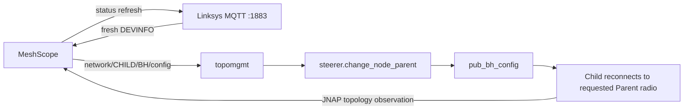

# Exact Parent steering over Linksys MQTT

MeshScope v0.5.0 turns the previously documented internal MQTT path into a
reproducible, guarded desktop API. It is intended only for a Linksys mesh you
own or are authorized to administer.

## What was validated

The complete path was exercised on an MX4200 v1 running a custom image based
on official firmware `1.0.13.216903`:

1. the modified image booted on physical hardware without A/B rollback;
2. the LAN broker accepted the required ACL reads and refresh writes;
3. fresh `DEVINFO` supplied the requested Parent's current `5GH`/`5GL` BSSID
   and channel;
4. a QoS-1 request to `network/<CHILD-UUID>/BH/config` moved a test child from
   the primary node to another online node; and
5. a second request moved it back, with JNAP confirming each resulting Parent.

Names, UUIDs, BSSIDs, credentials, and household Client/STA data from that
validation are not published.

## Why the MX4200 rebuild boots

These are the critical differences between the booted Plan C2 image and an
earlier image that the router rejected or rolled back:

- Linksys/QSDK uses a **12-byte XZ compressor-options structure**; upstream
  SquashFS tools emit an incompatible 8-byte structure.
- All **503 XZ streams** in the official filesystem use plain LZMA2. The
  builder therefore disables automatic BCJ filter selection.
- The rebuilt SquashFS is padded to the official volume length, the UBI keeps
  the official PEB count, and the final IMG keeps the official byte length.
- The FIT/kernel prefix remains byte-for-byte unchanged. The Linksys footer is
  recalculated by `tools/linksys_mx_repack.py` without changing unrelated
  bytes.
- File type, mode, UID/GID, mtime, links, device numbers, xattrs, and unchanged
  file contents are compared after final re-extraction. The output IMG also
  inherits the source IMG's POSIX mode.
- The final image is re-extracted and checked for filesystem, UBI/container,
  size, footer, and firmware-validator consistency before it is returned.

Those controls explain the successful test; they cannot guarantee another
hardware revision, firmware build, NAND state, or flashing process. Retain the
official image and physical recovery access.

## Build from an official IMG

The repository does not contain or download Linksys firmware. On macOS,
install Lima once and supply an unmodified supported official image:

```bash
brew install lima
tools/build_linksys_mqtt_images_lima.sh \
  --mx4200 /path/to/FW_MX4200_1.0.13.216903_prod.img
```

MX5300 v1 is also supported:

```bash
tools/build_linksys_mqtt_images_lima.sh \
  --mx5300 /path/to/FW_MX5300_1.1.12.210066_prod.img
```

The first run creates an isolated Ubuntu LTS Lima VM, installs pinned build
dependencies, compiles the QSDK-compatible SquashFS tool, builds each selected
plan, and copies only verified outputs to
`firmware-analysis/work/mqtt-parent-images/<run-id>/`.

Supported official SHA-256 values:

| Model and build | SHA-256 |
|---|---|
| MX4200 v1 `1.0.13.216903` | `b0a954835c879822fd1a2da23f09a6ec37da69914aacf07d8038b06fa02fad25` |
| MX5300 v1 `1.1.12.210066` | `f51adff1395bb9d1b7f8d62fd080ba5c9f5e5589b6d22f92335792ba3261d651` |

The script refuses any other hash. Generated vendor-derived IMG files remain
ignored and are not attached to MeshScope releases.

## Choose an ACL plan

| Plan | Change | Intended use |
|---|---|---|
| A | Adds only six discovery/steering permissions to `strict.acl` | Recommended experiment |
| B | Selects the bundled `open.acl` for LAN port 1883 | Short isolated diagnostic |
| C2 (MX4200) | Selects open ACL and makes every bundled ACL open, using the boot-compatible fixed-size rebuild | Recovery/diagnostic when runtime ACL selection is uncertain |

Every plan exposes privileged control to the LAN. Plan A limits the MQTT
surface, but the stock LAN listener is anonymous; use a trusted network.

## Desktop API

The desktop server needs no third-party MQTT package. Its small MQTT 3.1.1
client performs a non-mutating capability check using only Plan A topics:

```http
GET /api/mqtt-parent-steering?refresh=1
```

It subscribes to `network/+/DEVINFO`, publishes the three idempotent Linksys
status-refresh topics, and reports availability only after receiving a fresh
DEVINFO record.

To request an exact Parent:

```http
POST /api/steer-node-parent
Content-Type: application/json

{"childId":"<child UUID>","parentId":"<parent UUID>","band":"5GH"}
```

Before publishing, MeshScope refreshes JNAP topology and rejects an offline or
unknown node, the primary node as a child, self-parenting, a descendant Parent,
a wired child, and the current Parent. It then resolves BSSID and channel from
fresh MQTT DEVINFO and publishes the child UUID in the uppercase topic form
required by the firmware.

A QoS-1 PUBACK means the broker accepted the message; it does not prove the
radio moved. The caller must refresh topology and observe the requested Parent
twice before declaring success. `tools/linksys_mqtt_steer.py` provides that
end-to-end CLI workflow and writes its sensitive operation journal only under
the Git-ignored `firmware-analysis/work/` tree by default.

```bash
python3 tools/linksys_mqtt_steer.py --router 192.168.1.1 probe-acl
python3 tools/linksys_mqtt_steer.py --router 192.168.1.1 steer \
  --child "Child Node" --parent "Requested Parent" --band 5GH --dry-run
```

Remove `--dry-run` only after reviewing the resolved live radio tuple. The
command prompts for the local Linksys password unless `LINKSYS_PASSWORD` or an
ignored `router_credentials.json` supplies it.

## Firmware data path



The ACL modification exposes an existing firmware consumer; it does not add
SSH, a shell, arbitrary MQTT execution, or a new radio-steering algorithm.
