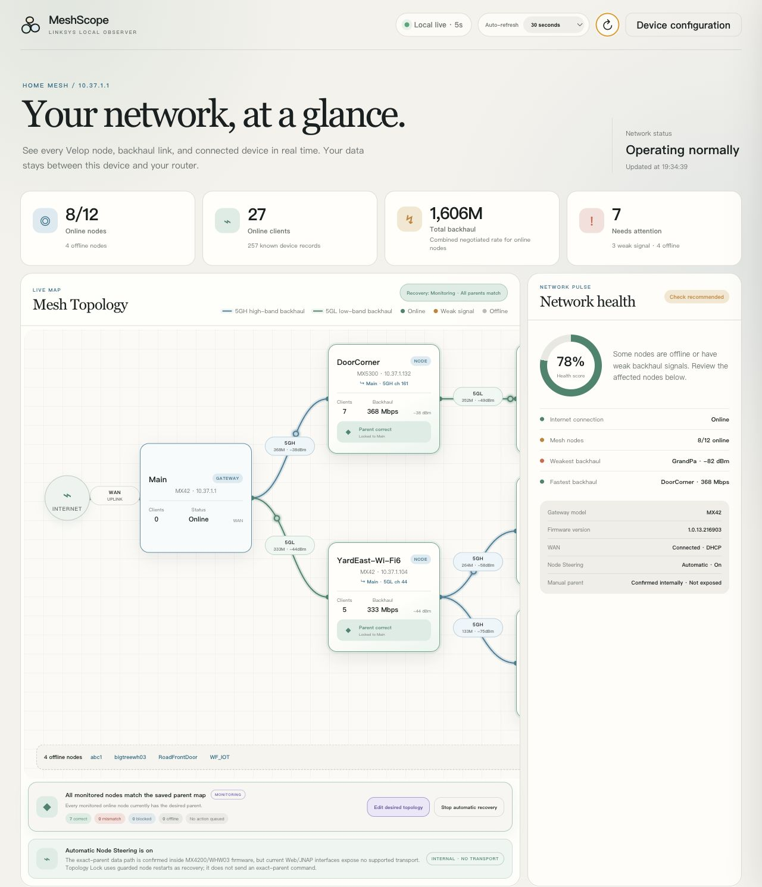

# Sharing MeshScope screenshots safely

MeshScope can show enough Client/STA detail to identify people, devices, and
daily activity inside a home. Treat the Client/Device table as private even
when the dashboard itself is reachable only on a trusted network.

## What a public image may show

- The Mesh Topology area
- Linksys node names when the network owner explicitly approves them
- Node model, private node IP, parent, backhaul band, channel, rate, and RSSI
- Aggregate node and client counts
- Network health and Topology Lock state
- Synthetic client data produced by desktop demo mode

## What a public image must not show

- A real Client/Device table or node-detail client list
- Client names, hostnames, aliases, MAC addresses, IP addresses, or UUIDs
- Router serial numbers, passwords, API keys, cookies, or WireGuard keys
- Public IP addresses, dynamic-DNS names, precise location, or account details
- Browser autofill, notifications, bookmarks, or unrelated desktop content

## Recommended capture workflow

1. Prefer `python3 linksys_mesh_app.py --demo` whenever client rows need to be
   visible.
2. For a live network, capture only the page area above the **Clients**
   heading. Do not capture the full page and plan to crop it later.
3. Close node-detail panels because they can contain client MAC and IP data.
4. Inspect the final image at full resolution, including its edges.
5. Confirm that the file contains no EXIF location or camera metadata.
6. Ask the network owner before publishing household node names or private
   node addresses.

## Repository examples

The repository overview includes real node-level topology with owner approval,
but stops before the Client/Device table. The Topology Lock image follows the
same boundary. Neither image contains a client name, client IP, MAC address,
device UUID, or serial number.

When in doubt, do not publish the live screenshot. Reproduce the behavior in
demo mode or describe it in text.
